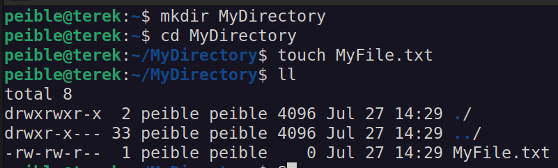
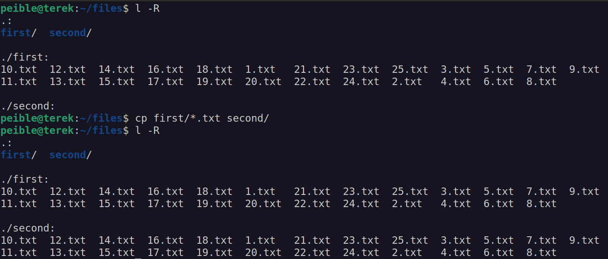
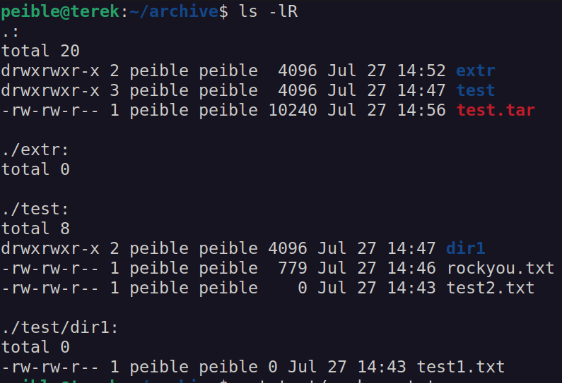
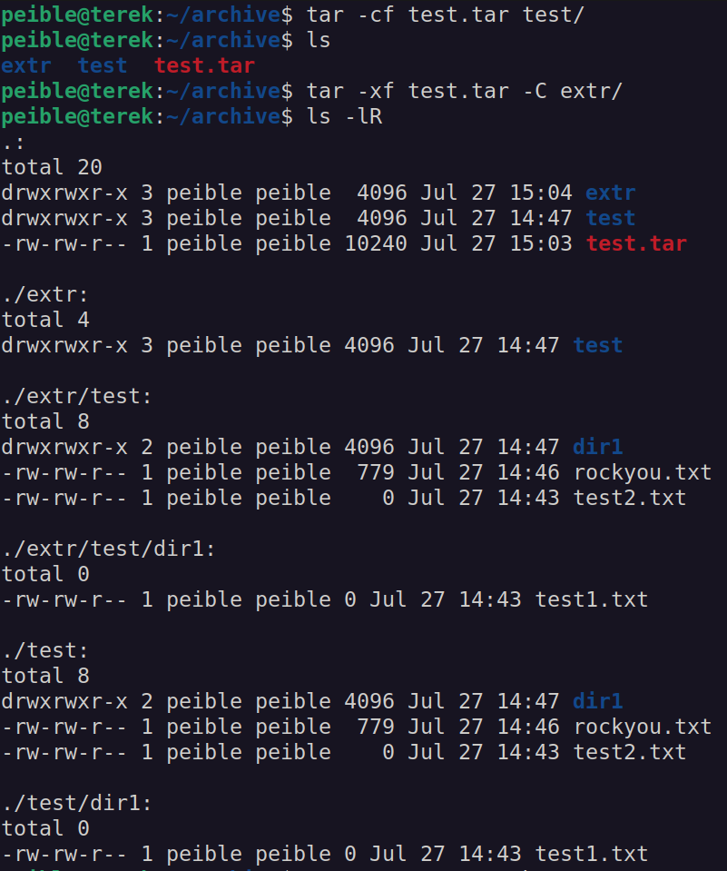
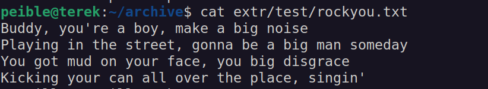

1. **Создание директории и файла:**

Создайте директорию с именем "MyDirectory" и в этой директории создайте файл "MyFile.txt". Затем выведите список файлов и директорий в текущем каталоге.



2. **Копирование файлов:**

Скопируйте все файлы с расширением ".txt" из одной директории в другую. Затем выведите список скопированных файлов.



3. **Поиск слова:**

Напишите скрипт, который будет искать все файлы в текущей директории и ее поддиректориях, содержащие слово "ключевое_слово". Выведите список найденных файлов.
```sh
#!/bin/bash
echo "enter keyword"
read keyword

dirList=$(ls -R)

echo $(echo "$dirList" | grep "$keyword")
```

  

4. **Архивирование и распаковка:**

Создайте архив (tar) из нескольких файлов и директорий, а затем распакуйте его. Убедитесь, что файлы восстановлены корректно.








5. **Обработка текстового файла:**

Создайте текстовый файл с несколькими строками текста. Напишите скрипт, который будет читать файл и выдавать каждую строку в обратном порядке.
```sh
path="/path/to/the/text"
while IFS= read line; do
    echo "$line" | rev
done < "$path"
```


6. **Автоматизация резервного копирования:**

Напишите скрипт, который будет регулярно (например, каждую неделю) создавать резервные копии определенных директорий и сохранять их с датой в имени файла.

  

7. **Подсчет количества слов:**

Напишите скрипт, который будет принимать текстовый файл в качестве аргумента и подсчитывать количество слов в этом файле.

  

8. **Создание случайных паролей:**

Напишите скрипт, который будет генерировать случайные пароли заданной длины и сохранять их в файл.
```sh
#!/bin/bash
echo "enter a number of lengths"
read length
password=""
arr=(\! \@ \# \$ \% \& \* \_ \- a b c d e f g h i j k l m n o p q r s t u v w x y z A B C D E F G H I J K L M N O P Q R S T U V W X Y Z 1 2 3 4 5 6 7 8 9 0)

for i in $(seq 1 $length); do
  password+=${arr[$RANDOM % 21]}
done

echo $password >> password.txt
echo "Password generation complete. The password has been saved to password.txt."
```

9. **Подсчет файлов:**

Напишите скрипт, который будет использовать цикл for для подсчета количества файлов и директорий в текущей директории.
### FOR
```sh
#!/bin/bash
list=$(ls -l | tail -n +2)

files=0
dirs=0
IFS=$'\n'
for line in $list; do
    if [[ ${line:0:1} == d ]]; then
        ((dirs++))
    elif [[ ${line:0:1} == '-' ]]; then
        ((files++))
    fi
done

echo "Directories: ${dirs}"
echo "Files: ${files}"

```
### WHILE
```sh
#!/bin/bash
list=$(ls -l | tail -n +2)

files=0
dirs=0
while IFS= read -r line; do
    if [[ ${line:0:1} == d ]]; then
        ((dirs++))
    elif [[ ${line:0:1} == '-' ]]; then
        ((files++))
    fi
done <<< "$list"

echo "Directories: ${dirs}"
echo "Files: ${files}"
```
  

10. **Автоматизация задачи обновления системы:**

Напишите скрипт, который будет проверять наличие обновлений системы и, если они доступны, автоматически устанавливать их.